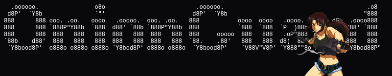

<div align="center">



<br>

# OnionGuard File Host (Zero-JS)

> A sovereign, minimal, and educational reference file hosting service written in Go, protected by [OnionGuard](https://github.com/ihatemyfcklife/onionguard) with 100% Zero JavaScript.  
> Designed as a concrete integration example for **Tor Onion Services (`.onion`)** and anonymous web services.

</div>

---

> [!WARNING]
> **DISCLAIMER: EDUCATIONAL PROOF-OF-CONCEPT ONLY**  
> This repository is a minimal educational reference example demonstrating how to integrate the [OnionGuard](https://github.com/ihatemyfcklife/onionguard) admission-control engine into a standard Go HTTP service without JavaScript.  
> **It is NOT production-ready, NOT security-audited, and NOT safe for real-world production environments.**  
> Do not use this service to host sensitive data or run it in public/untrusted environments without extensive security hardening, sandboxing, malware scanning, and domain-specific access controls.

---

## Why this project?

In Tor Onion Services (`.onion`) and privacy-preserving environments:
1. **IP addresses do not exist**: All traffic originates from localhost (`127.0.0.1`) or Tor proxy daemons. Traditional Web Application Firewalls (Cloudflare, AWS WAF, Fail2ban) cannot differentiate clients by IP and end up blocking all users or providing zero defense.
2. **Tor Browser users disable JavaScript**: In Tor Browser's "Safest" security mode, JavaScript is completely disabled. Standard CAPTCHAs (reCAPTCHA, hCaptcha, Turnstile) fail completely.
3. **Browser fingerprinting and tracking break anonymity**.

This project provides a practical, concrete example of a zero-JavaScript anonymous file hosting service protected by **[OnionGuard](https://github.com/ihatemyfcklife/onionguard)**, an open-source, sovereign HTTP admission-control engine built specifically for anonymous environments.

---

## Key Features

- **100% Zero JavaScript**:
  - Works natively in Tor Browser in **Safest** security mode (scripts disabled).
  - Standard HTML5 multipart file upload forms (`multipart/form-data`).
  - Dark terminal theme styled with pure inline CSS to comply with strict Content Security Policies (`default-src 'none'`).
- **OnionGuard Protection Engine**:
  - **Wait Room (Proof of Patience)**: Anti-DoS friction using native `<meta http-equiv="refresh">` redirection without JavaScript.
  - **Pure Go Bitmap CAPTCHA**: Server-rendered PNG image with sine-wave noise interference, verified via standard HTML form submission.
  - **Per-Session Rate Limiting**: Token-bucket quotas tracked per 256-bit cryptographic session without inspecting client IP addresses.
  - **API Bearer Token Support**: Automated clients (e.g. `curl` or scripts) can bypass challenges using OnionGuard's multi-tier identity model.
  - **Strict Security Headers**: CSP, `no-store`, `nosniff`, `frame-ancestors 'none'`.
- **Pragmatic File Hosting ("Don't reinvent the wheel")**:
  - **Configurable Retention (TTL)**: 1h, 24h, 7d, 30d with an automated background janitor that purges expired files.
  - **Burn After Read**: Optional setting to permanently destroy the file immediately after its first download.
  - **Secret Deletion Key**: Allows the uploader to delete the file before expiration.
  - **Session Tracking**: Displays files uploaded during the active OnionGuard session without requiring user registration or accounts.
  - **Integrity Verification**: Automatic on-the-fly SHA-256 checksum calculation.
  - **Safe Preview**: Image preview and escaped text sample viewing.

---

## Quick Start

### Prerequisites
- **Go 1.22+**

### 1. Build

```bash
git clone https://github.com/ihatemyfcklife/onionguard-filehost-template.git
cd onionguard-filehost-template
make build
```

### 2. Run

```bash
make run
# Or execute binary directly:
./bin/filehost
```

The server starts by default on `http://localhost:8080`.

### 3. Run Tests

```bash
make test
```
*Runs all unit and integration tests with the Go race detector enabled (`-race`).*

---

## Configuration (Environment Variables)

All options can be configured without recompiling:

| Variable | Default | Description |
|---|---|---|
| `LISTEN_ADDR` | `:8080` | TCP listen address for the HTTP server |
| `DATA_DIR` | `./data` | Directory for file storage and `meta.json` |
| `MAX_UPLOAD_MB` | `25` | Max upload size in megabytes (up to 100 MB with OnionGuard) |
| `WAIT_ROOM_ENABLED` | `true` | Enables the proof-of-patience wait room |
| `WAIT_ROOM_SECONDS` | `3` | Wait room duration in seconds |
| `CAPTCHA_ENABLED` | `true` | Enables the zero-JS bitmap CAPTCHA challenge |
| `API_BEARER_TOKEN` | *(empty)* | Optional secret key allowing scripts to bypass the CAPTCHA |
| `SITE_TITLE` | `OnionGuard File Host (Zero-JS)` | Site title shown in header and page titles |

Example:
```bash
API_BEARER_TOKEN="super-secret-key" MAX_UPLOAD_MB=50 make run
```

---

## Usage

### Browser (Tor Browser or Standard Browser)
1. Navigate to `http://localhost:8080`.
2. First-time visitors are placed in the **Waiting Room** (3 seconds) followed by the **Zero-JS bitmap CAPTCHA**.
3. Once verified, an admitted cryptographic session cookie is issued.
4. Select a file, set the retention duration (1h, 24h, 7d, 30d), and choose whether to enable *Burn after read*.
5. You receive a direct download link, file details with SHA-256 hash, and an instant deletion button.

### Command-Line (cURL / Automated Scripts)

#### With Session Cookie:
```bash
curl -F "file=@document.pdf" -F "ttl=24h" -F "burn=1" http://localhost:8080/upload
```

#### With API Bearer Token (Bypasses CAPTCHA directly):
```bash
curl -H "Authorization: Bearer super-secret-key" \
     -F "file=@sample.txt" \
     -F "ttl=7d" \
     http://localhost:8080/upload
```

JSON Response:
```json
{
  "id": "4b7f8e12a9c3d4e5",
  "name": "sample.txt",
  "size": 1024,
  "sha256": "e3b0c44298fc1c149afbf4c8996fb92427ae41e4649b934ca495991b7852b855",
  "view_url": "http://localhost:8080/v/4b7f8e12a9c3d4e5",
  "download_url": "http://localhost:8080/d/4b7f8e12a9c3d4e5",
  "delete_token": "a1b2c3d4e5f60718293a4b5c6d7e8f90",
  "burn_read": false,
  "expires_at": "2026-09-26T22:30:00Z"
}
```

#### Download:
```bash
curl -OJ http://localhost:8080/d/4b7f8e12a9c3d4e5
```

#### Early Deletion with Secret Token:
```bash
curl -X POST -d "token=a1b2c3d4e5f60718293a4b5c6d7e8f90" http://localhost:8080/delete/4b7f8e12a9c3d4e5
```

---

## Tor Onion Service Deployment

To deploy as a Tor Hidden Service (`.onion`):

1. Install the Tor daemon:
   ```bash
   sudo apt install tor
   ```

2. Add the hidden service definition in `/etc/tor/torrc`:
   ```torrc
   HiddenServiceDir /var/lib/tor/filehost_service/
   HiddenServicePort 80 127.0.0.1:8080
   ```

3. Restart Tor:
   ```bash
   sudo systemctl restart tor
   ```

4. Read your `.onion` hostname:
   ```bash
   sudo cat /var/lib/tor/filehost_service/hostname
   # Example: 7xkv4...abcd.onion
   ```

5. Start the file host:
   ```bash
   ./bin/filehost
   ```
   The service is now accessible anonymously over Tor.

---

## Security Guarantees

- **No Client IP Logging**: The engine and application ignore `RemoteAddr`, `X-Forwarded-For`, and `X-Real-IP`.
- **Enumeration Resistant**: Non-sequential, cryptographic random hexadecimal identifiers.
- **Path Traversal Protection**: Original filenames are never used as filesystem paths.
- **Denial-of-Service Defense**: Multi-tier token-bucket rate limiting per session and per route.

---

## License

MIT / Apache 2.0
